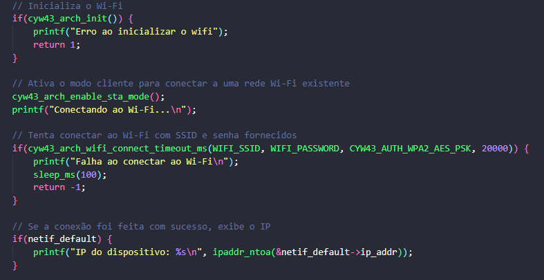
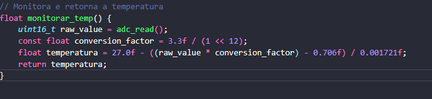
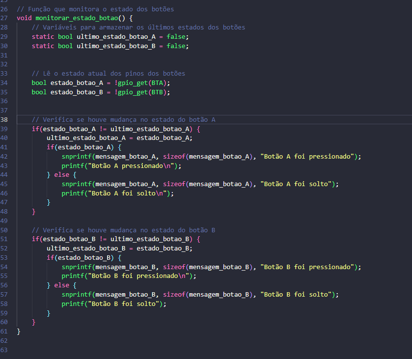
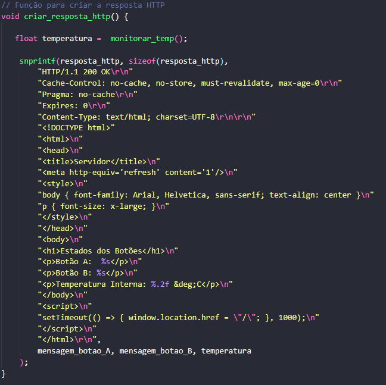

# Servidor Web com Monitoramento de Botões e Temperatura

Este projeto implementa um servidor web simples usando o Raspberry Pi Pico W, que exibe em tempo real:

- O estado de dois botões físicos (Botão A e Botão B)
- A temperatura interna do microcontrolador

A página web é atualizada automaticamente a cada segundo.

## Hardware Utilizado

- Raspberry Pi Pico W
- Chip Wi-Fi (Infineon CYW43439)
- Sensor de temperatura (ADC 4)
- Botão A (GPIO 5)
- Botão B (GPIO 6)

## Funcionalidades

- Conexão à rede Wi-Fi usando o chip CYW43 embutido no Pico W
- Leitura da temperatura interna do chip via ADC
- Monitoramento dos estados dos botões A e B da placa
- Servidor HTTP que responde com uma página HTML dinâmica
- Atualização automática da página a cada 1 segundo

## Estrutura do Código

- **Conexão com Wi-Fi**:  
  

- **Leitura de Temperatura**:  
  

- **Monitoramento dos Botões**:  
  

- **Servidor Web**:  
  

## Funções

- `iniciar_botoes()`: Configura os pinos dos botões como entrada com resistor de pull-up interno ativado, permitindo detectar quando estão pressionados (nível lógico baixo)
- `monitorar_estado_botao()`: Atualiza as mensagens `mensagem_botao_A` e `mensagem_botao_B` de acordo com o estado atual dos botões
- `iniciar_temp()`: Inicializa o ADC interno e configura o canal correspondente ao sensor de temperatura do chip
- `monitorar_temp()`: Realiza a leitura bruta da temperatura pelo ADC, converte para graus Celsius e retorna o valor
- `criar_resposta_http()`: Gera dinamicamente a resposta HTTP contendo a estrutura HTML com os dados dos botões e da temperatura
- `http_callback()`: Callback chamado ao receber uma requisição HTTP; responde com a página gerada e libera o buffer recebido
- `connection_callback()`: Callback acionado quando uma nova conexão TCP é estabelecida; associa essa conexão ao `http_callback`

## Requisitos

- Raspberry Pi Pico W
- SDK do Raspberry Pi Pico instalado
- Ambiente de desenvolvimento C/C++ para o Pico (como VSCode com CMake)

## Instalação

1. **Clonar o repositório**  
   ```bash
   git clone https://github.com/Rafael-Casemiro/Monitoramento_web_server.git
   ```

2. **Navegar até o diretório do projeto**  
   ```bash
   cd Monitoramento_web_server
   ```

3. **Criar e entrar na pasta de build**  
   ```bash
   mkdir build && cd build
   ```

4. **Gerar arquivos de build com CMake**  
   ```bash
   cmake ..
   ```

5. **Compilar o projeto**  
   ```bash
   make
   ```

6. **Gravar o arquivo `.uf2` no Raspberry Pi Pico W**  
   - Copie o arquivo `.uf2` gerado na pasta `build` para a unidade que aparecerá

